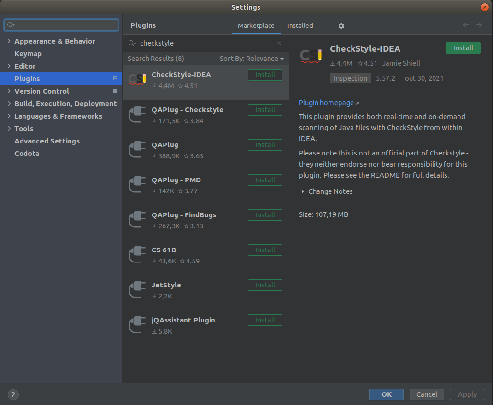
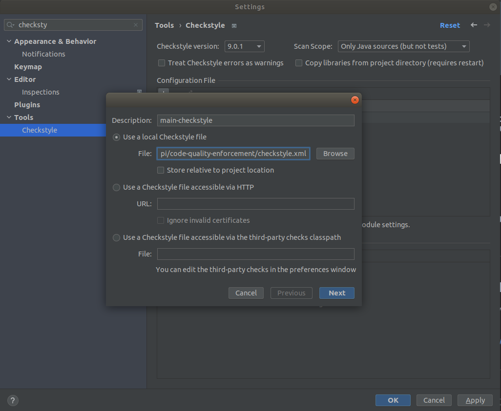
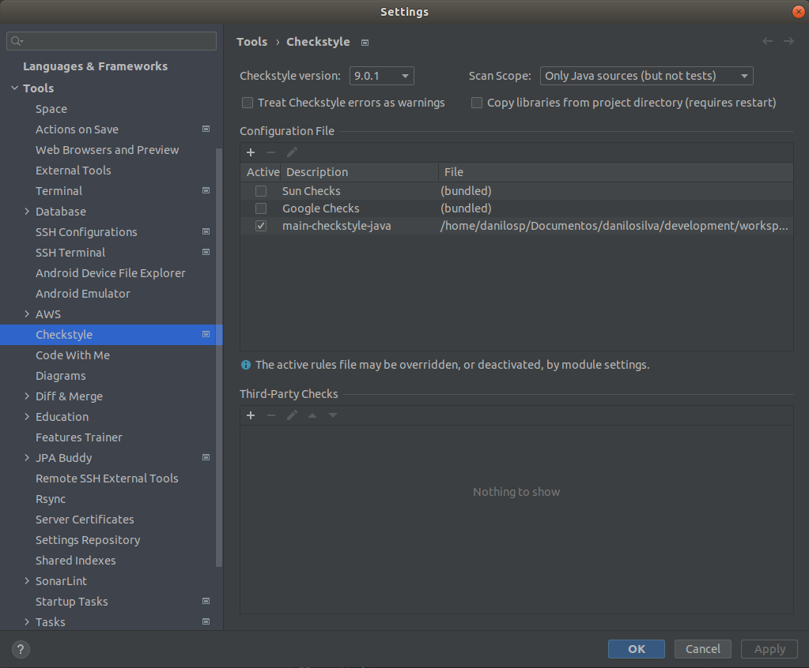
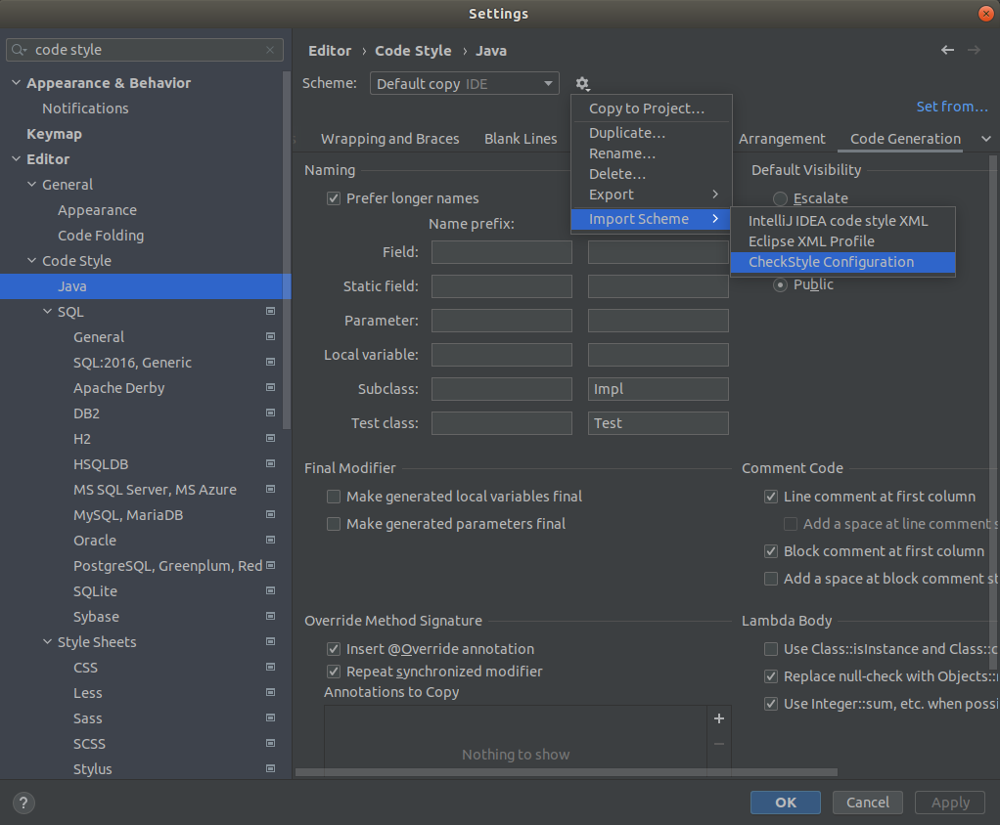

    
<h4 align="center">
    <a href="https://rocketmusics.herokuapp.com/">Live demo</a>
</h4>

<h3 align="center">
    Simple, fast and reactive application to convert values between all currencies.
</h3>

<p align="center">
  

  

  <a href="https://github.com/dansilva41/currency-transaction/commits/main">
    
  </a>

   
   <a href="https://github.com/dansilva41/currency-transaction/stargazers">
    
  </a>

  <a href="https://dansilva41.github.io">
    
  </a>

  <a href="https://developers-friends.gitbook.io/">
    
    </a> 
</p>

<p align="center">
 <a href="#dizzy-about">About</a> •
 <a href="#mega-features">Features</a> • 
 <a href="#rocket-technologies-and-motivation">Technologies and motivation</a> •
 <a href="#scroll-structure">Structure</a> •
 <a href="#computer-building-locally">Building Locally</a> •
 <a href="#memo-license">License</a>

</p>

## :dizzy: About

This application is designed with currency-based value conversion in mind, where the focus is to get the conversion rates from an [external api](https://exchangeratesapi.io),
perform the conversion calculations, persist the data and return to consistent data.
In addition to offering performance due to its reactive behavior, the application provides a way to consult the conversions already carried out by the user.

---
## :mega: Features

|          Actions                                  |     Available       |
| --------------------------                        | :-----------------: |
| Converting value between all currencies           |         ✔️           |
| Get all conversions performed by user             |         ✔️           |

---

## :rocket: Technologies and motivation

The project was developed using the following technologies

- [Spring](): It makes programming in Java faster, easier and safer. Compared to other web ecosystems such as Quarkus, Vert.x, Javalin, it has a very simple configuration, with a large and present community, which makes it easier in the midst of development mishaps.
- [Spring WebFlux](): In order to build an application aimed at the REST API, but to bring reactivity, asynchronism and performance, Spring Web Flux is able to provide this, keeping the code common to the conventional synchronous Rest API.
- [Reactive MongoDB Embedded](): Provide a platform-neutral way to run embedded mongodb, not relying on an external server for the application and with a very fast build, dynamic by instance and powerful in processing.
- [Open API](): Pursuing the API first concept, this specification enables independent writing of the REST APIs and the result is a complete documentation of request and response endpoints and objects
- [Wiremock](): In order to perform integration tests in the application validation (check), Wiremock in an embedded way and with dynamic routes, makes it possible to test the flows where there is external communication and to validate error treatments, response bodies and logic.
- [Lombok](): Lombok is used to reduce boilerplate code for model/data objects, e.g., it can generate getters and setters for those object automatically by using Lombok annotations.
- [GitHub Actions](): As CI / CD process GitHub Actions provides a simple, powerful, integrated with various cloud providers and with the processing power and full feedback, therefore, it fulfills the final release of this product.
- [Heroku](): Because it is flexible and with the possibility of deployment either via console or as part of the CI/CD deployment process from GitHub Actions, it is able to publish a new version of the application for free

---

## :scroll: Structure

```text
.
├── code-quality-enforcement                                Directory that stores files related to code quality
├── docs                                                    README.md documentation related files
├── logs                                                    Folder that stores application log records
├── src
│   ├── main
│   │   ├── java
│   │    │    └── tech.jaya.currencytransaction             Application main package
│   │    │        ├── configuration                         Layer where the necessary instances are configured via Dependency Injection   
│   │    │        ├── core                                  Application domain layer. Logic, dependent objects and business rules are found here.
│   │    │        ├── dataprovider                          Implementation layer in data search and return, where there is a specific implementation of each external provider
│   │    │        ├── entrypoint                            Presentation layer and exposure of asynchronous resources, as well as handling requests and errors
│   │    │        ├── CurrencyTransactionApiApplication     Main class
│   │    └── resources
│   │        ├── i18n                                       Directory reserved for storing files differentiated by locale in messages interpolation
│   │        │   └── messages.properties                    Default messages
│   │        ├── static                                     
│   │        │   └── open-api.yaml                          Descriptive file of the application's API specification
│   │        ├── application.properties                     File that stores basic application information
│   │        ├── application.yaml                           Application custom settings definition file
│   │        └── logback.xml                                Configuration file for launching and handling logs
│   └── test
│       ├── java/tech/jaya/currencytransaction              Package where unit testing and integration testing implementations are concentrated
│       └── resources
│           ├── mock                                        Directory reserved for storing JSON files used by Wiremock fake requests
│           └── application-test.xml                        Application custom settings definition file in the context of tests
├── target
│   └──currency-transaction-api-0.0.1.jar                   Generated jar
├── pom.xml                                                 Fundamental unit of work in Maven for defining, resolving dependencies, and building the project
├── LICENSE.md                                              Application license definition
└── README.md                                               Application Documentary File
```

## :computer: Building Locally

### Requirements

- [Maven]()
- [Java 11]()

### Install

1. Clone the repository

   `git clone git@github.com:DanSilva41/currency-transaction.git`

2. Enter directory
   
    `cd currency-transaction`

3. Install dependencies
   
    `mvn clean install`

### Run application

    mvn springboot:run
---

### Additional

#### Checkstyle

<details>
    <summary>01. Checking the project via maven plugin</summary>

- To run the check in the project, just use this maven command in shell/console or run via IDEA.

```bash
    mvn checkstyle:check
```
- To generate a report from the analysis of code style violations, just use this maven command in shell/console or run via IDEA.

```bash
    mvn checkstyle:checkstyle
```
Report generated in **target/site/checkstyle.html**.

</details>

<details>
    <summary>02. Installing the CheckStyle-IDEA plugin on IntelliJ</summary>

We can use the CheckStyle-IDEA plugin to help formatting code in the IDE.
To configure it is very simple, first install the plugin via the link above or on IntelliJ at
**File > Settings > Plugins**.



### 02. Configuring the CheckStyle-IDEA plugin

- After installation, we need to import the settings defined in the checkstyle.xml file into the CheckStyle-IDEA plugin.
  Navigate to **File > Settings > Tools > Checkstyle** and in **Configuration File** click **Add** (+ sign on the right), indicate the path of your checkstyle.xml and click next.



- With the file imported, don't forget to leave it selected as **Active**.



- Now let's add the same checkstyle file to the IntelliJ settings itself, so when we use the default formatting shortcuts it will automatically look for Checkstyle Main.
  Within settings, go to **Editor > Code Style > Java** and import the file as shown in the image below:



- Once these settings are finished, the CheckStyle option will appear at the bottom of IntelliJ and when clicking, the screen below will appear.
  At this point, in Rules select the one you imported in the previous steps and run the verification.

- In Intellij IDEA, select the project, package(s) or class(es) and **Right click > Analyse > Inspect Code... > OK** then plugin will indicate the problems found.

</details>

---

## :memo: License
This project is under the MIT license. See the [LICENSE](https://github.com/dansilva41/currency-transaction/blob/main/LICENSE) for more information.

Developed by Danilo Silva :wave: [Get in touch!](https://www.linkedin.com/in/danilosilvap/)

[Spring]: https://spring.io/
[Spring WebFlux]: https://docs.spring.io/spring-framework/docs/current/reference/html/web-reactive.html
[Reactive MongoDB Embedded]: https://github.com/flapdoodle-oss/de.flapdoodle.embed.mongo
[Project Reactor]: https://projectreactor.io/
[Open API]: https://swagger.io/specification/
[Wiremock]: http://wiremock.org/
[Lombok]: https://projectlombok.org/
[GitHub Actions]: https://github.com/features/actions
[Heroku]: https://www.heroku.com/what
[Maven]: https://maven.apache.org/install.html
[Java 11]: http://www.oracle.com/technetwork/java/javase/downloads/index.html